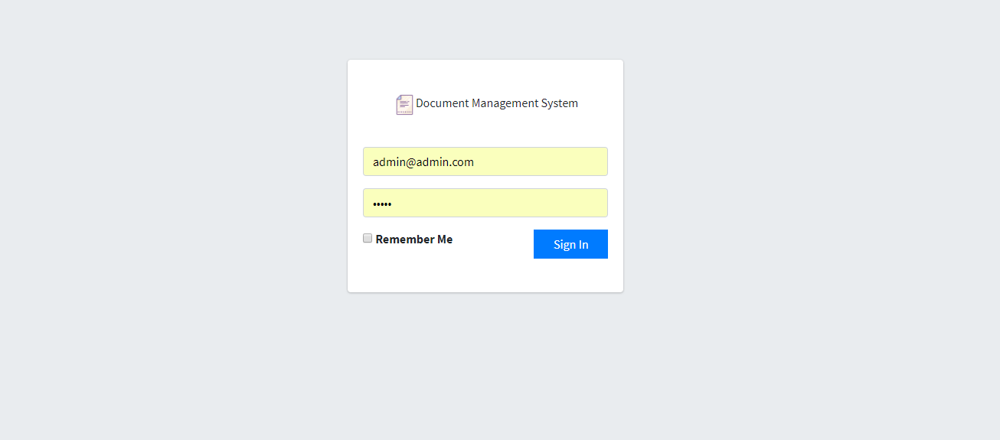
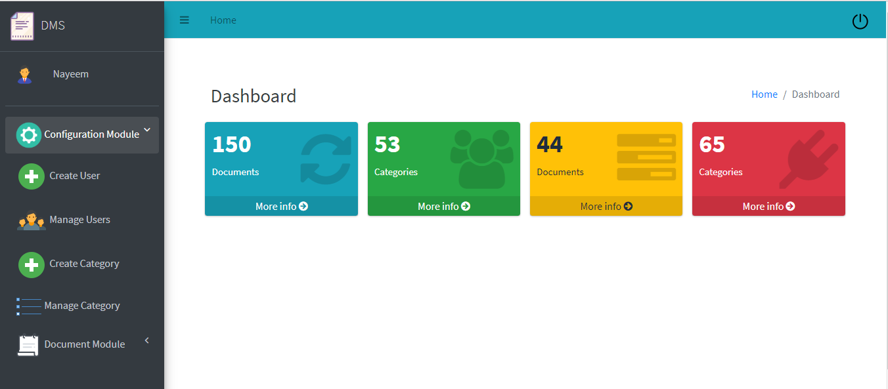
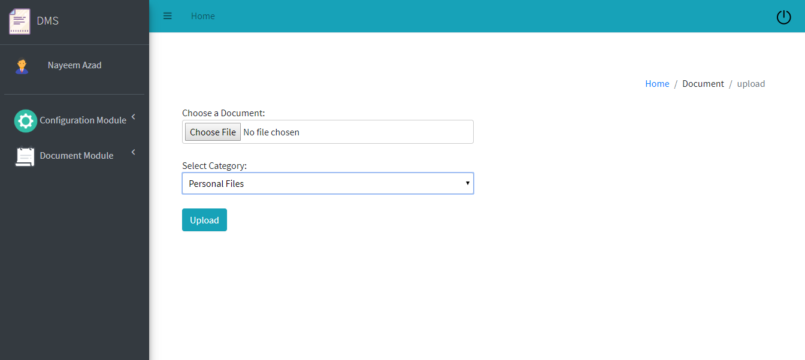
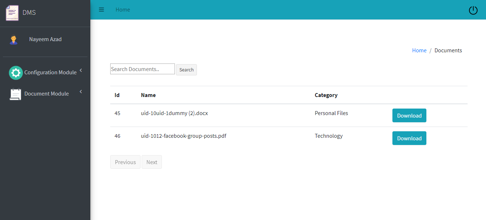

# DMS -Document Management System

Technologies Used: C# ASP.NET core 2.1 (MVC ) , 3-tier Architechture, EF Code First

# Features
<ul>
	<li>Admin Creates Users & assign Roles</li>
	<li>User get notified by email for credentials</li>
	<li>User get notified by email for credentials</li>
	<li>User can creates own categories</li>
	<li>User can upload own documents</li>
	<li>User can Searche & Downloads</li>
</ul>

# Screenshots

